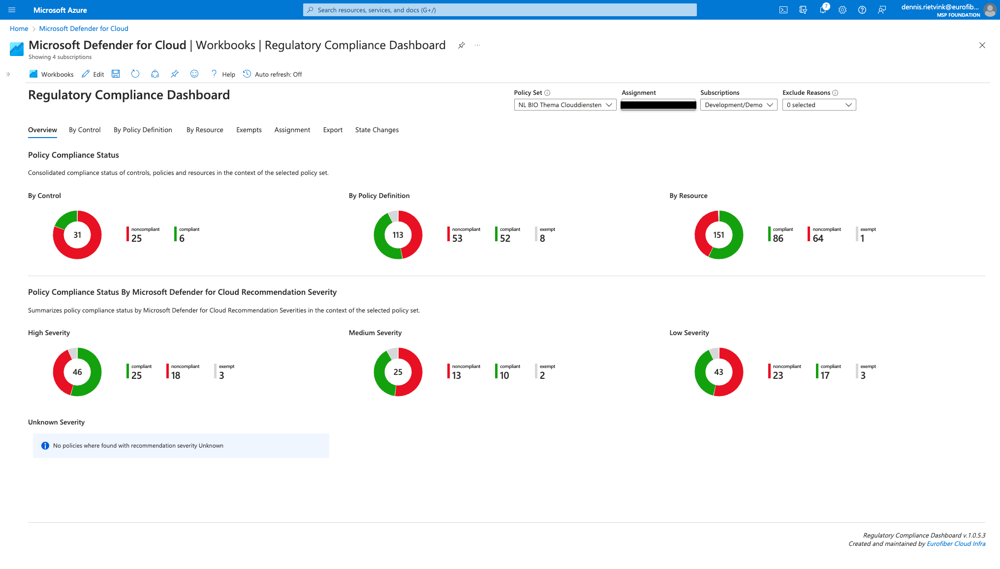
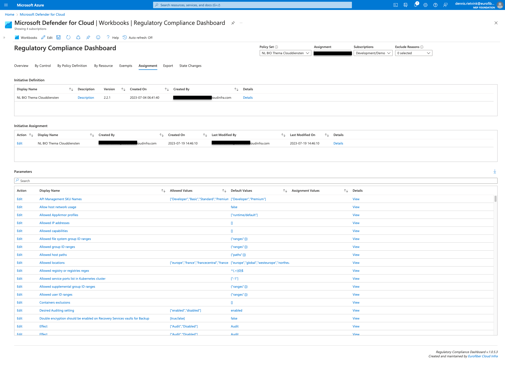
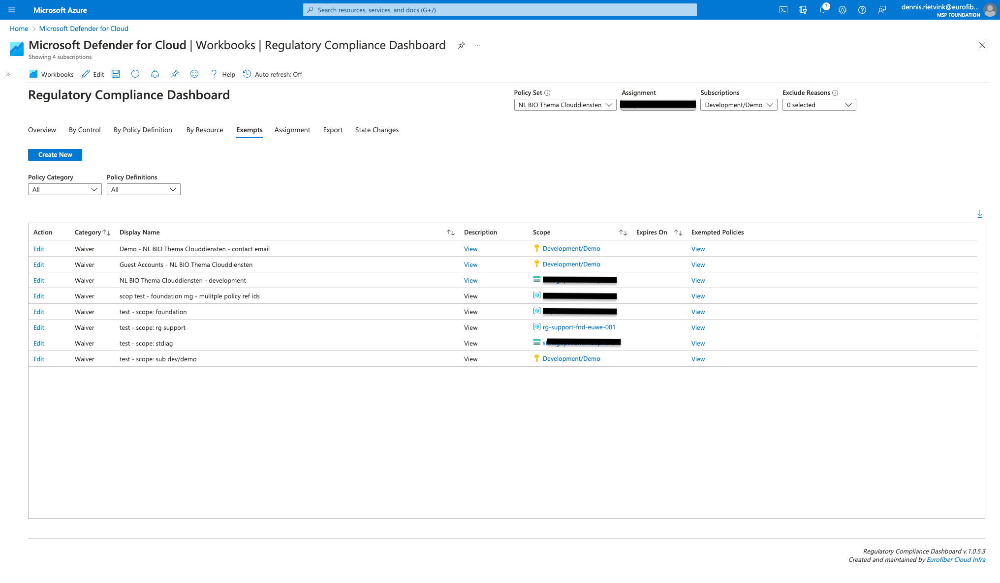

# Regulatory Compliance Workbook

- [Main features](#main-features)
- [Deploy the Workbook](#deploy-the-workbook)
- [Open the Workbook](#open-the-workbook)
- [Examples](#examples)
  - [Overview](#overview)
  - [In Context Details](#in-context-details)
  - [Assignment Details](#assignment-details)
  - [Exemption List](#exemption-list)
  - [Export](#export)
  - [State Changes](#state-changes)

This Azure workbook was initially created to help our Dutch government customers to visualize compliance information produced by the [BIO Compliance Initiative](https://github.com/Azure/Bio-Compliancy). As the workbook targets policy initiatives of category **Regulatory Compliance** it can also be used for other regulatory compliance initiatives.

## Main features
- Combines policy state information with Defender for Cloud recommendation severities
- Shows policy state information in the context of Controls, Policy Definitions and Resources
- Provides several contextual links to relevant Azure portal pages
- Export compliance report to Excel
- Shows effective exemption information for a resource based on policy definition
- Shows policy state change information

Check the [changelog](./CHANGELOG.md) for the latest changes.

## Deploy the Workbook

The workbook can be deployed in your environment using the **Deploy to Azure** button below.   

## Open the Workbook

The workbook can be opened from the resource group where it has been deployed or from the **Defender for Cloud** page in the Azure portal. It can be found under the **Workbooks** section (make sure you have select the subscription where the workbook has been deployed).   
<kbd></kbd>

## Examples

### Overview
<kbd></kbd>

### In Context Details
By selecting a row you can view additional information on control, policy definition, resource or exemption.
 
 
<kbd></kbd>

Look up the effective exemption information for the selected resource policy combination.
 
 
<kbd></kbd>

### Assignment Details
<kbd></kbd>

### Exemption List
See all exemptions for the selected policy set assignment. The list can be filtered on policy definition to view only exemptions that are effective for the selected policy definition.
 
 
<kbd></kbd>

### Export
The export section allows you to export complliance state totals per control or policy definition.
 
 
<kbd></kbd>

### State Changes
Policy state changes shows the state change events for a selected time frame. The events are collected using an Events Grid System Topic. An explanation on how to setup such a configuration can be found [here](https://github.com/Eurofiber-CloudInfra/azure-policy-insights).
 
 
<kbd></kbd>

