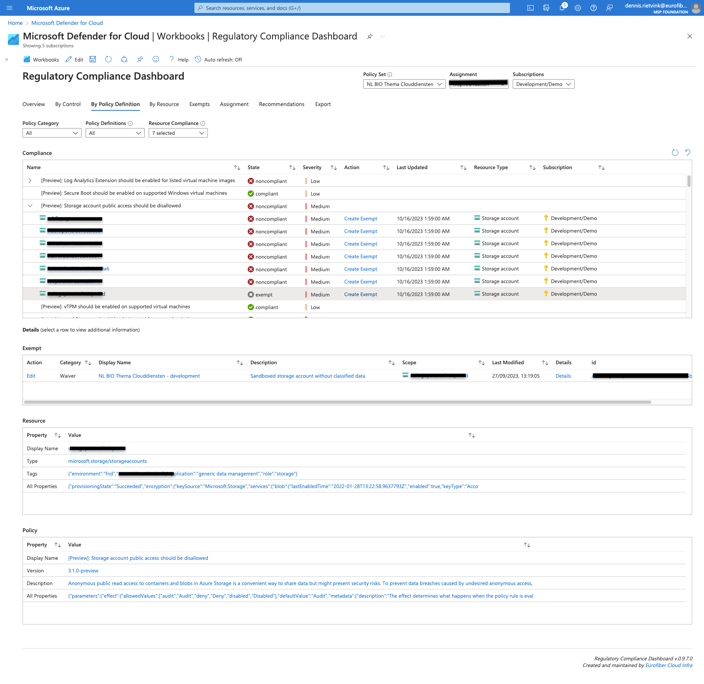

# Regulatory Compliance Workbook

This Azure workbook was initially created to help our Dutch government customers to visualize compliance information produced by the [BIO Compliance Initiative](https://github.com/Azure/Bio-Compliancy). As the workbook targets policy initiatives of category **Regulatory Compliance** it can also be used for other regulatory compliance initiatives.

## Main features:
- Combines policy state information with Defender recommendation severities
- Shows policy state information in the context of Controls, Policy Definitions and Resources
- Shows detailed context information on Exempts, Controls, Policy Definitions and Resources
- Provides several contextual links to relevant Azure portal pages
- Export compliance report to Excel

## Examples

### Overview
<kbd></kbd>

### In Context Details
<kbd></kbd>

### Contextual Links
<kbd></kbd>

### Export
<kbd></kbd>

## Deploy the Workbook

The workbook can be deployed in your environment using the **Deploy to Azure** button below.   

## Open the Workbook

The workbook can be opened from the resource group where it has been deployed or from the **Defender for Cloud** page in the Azure portal. It can be found under the **Workbooks** section (make sure you have select the subscription where the workbook has been deployed).   
<kbd></kbd>

